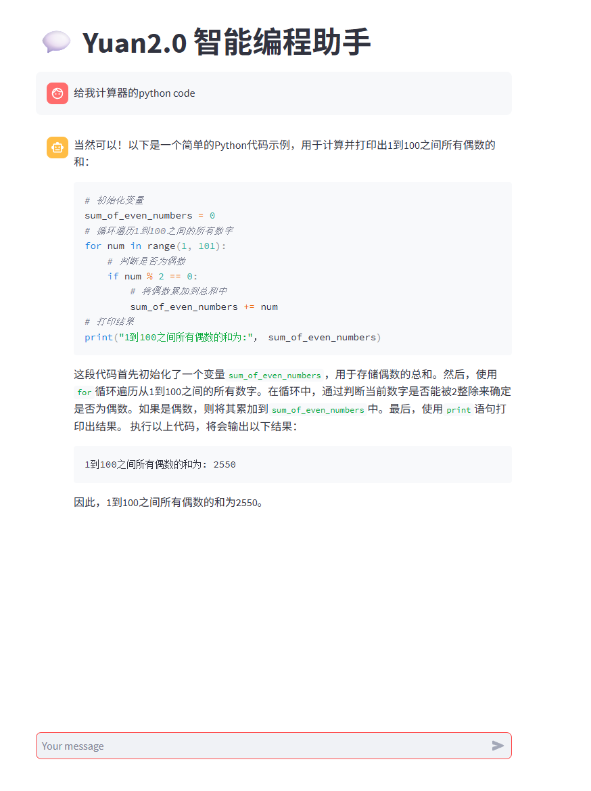

# Task1案例：智能编程助手

## 作业过程记录

任务比较简单，基本上是复制粘贴代码，唯一要动手的就是注册阿里云或者魔塔。两个我都嫌麻烦-W-就用了Github的Codespace。

在用Codespace之前，尝试了Google的Colab，结果发现Colab不支持直接streamlit运行web应用，必须要用ngrok之类的工具做端口映射，折腾了半天也没成功，就放弃了。菜鸟就是得亲自走弯路wwww。

Codespace没有GPU...感觉要完。

……转到阿里云，还是老问题，缺依赖，比codespace缺的少一点而已。

### 遇到下一个bug：

'''File "/usr/local/lib/python3.10/dist-packages/streamlit/runtime/scriptrunner/script_runner.py", line 552, in _run_script
    exec(code, module.__dict__)
File "/mnt/workspace/AICamp_yuan_baseline/Task 1：零基础玩转源大模型/web_demo_2b.py", line 57, in <module>
    outputs = model.generate(inputs, do_sample=False, max_length=1024) # 设置解码方式和最大生成长度
File "/usr/local/lib/python3.10/dist-packages/torch/utils/_contextlib.py", line 116, in decorate_context
    return func(*args, **kwargs)
File "/usr/local/lib/python3.10/dist-packages/transformers/generation/utils.py", line 2633, in generate
    result = self._sample(
File "/usr/local/lib/python3.10/dist-packages/transformers/generation/utils.py", line 3614, in _sample
    outputs = self(**model_inputs, return_dict=True)
File "/usr/local/lib/python3.10/dist-packages/torch/nn/modules/module.py", line 1739, in _wrapped_call_impl
    return self._call_impl(*args, **kwargs)
File "/usr/local/lib/python3.10/dist-packages/torch/nn/modules/module.py", line 1750, in _call_impl
    return forward_call(*args, **kwargs)
File "/root/.cache/huggingface/modules/transformers_modules/Yuan2-2B-Mars-hf/yuan_hf_model.py", line 984, in forward
    outputs = self.model(
File "/usr/local/lib/python3.10/dist-packages/torch/nn/modules/module.py", line 1739, in _wrapped_call_impl
    return self._call_impl(*args, **kwargs)
File "/usr/local/lib/python3.10/dist-packages/torch/nn/modules/module.py", line 1750, in _call_impl
    return forward_call(*args, **kwargs)
File "/root/.cache/huggingface/modules/transformers_modules/Yuan2-2B-Mars-hf/yuan_hf_model.py", line 752, in forward
    past_key_values_length = past_key_values[0][0].shape[2]'''

解决方案：
把代码里

outputs = model.generate(inputs, do_sample=False, max_length=1024)

这一行前面，加一行

'model.config.use_cache = False'

这样就能跑通了。说得轻松其实改了老一阵。

## 体验总结
作为一个demo需要我多次debug才能跑通，说明这个demo的可用性还是有待提升的。体验不大好，至少该有个requirements.txt，或者一个一键安装脚本之类的。

如果真的要用demo，不如直接API调用一个模型，省事很多。这个demo的复杂程度高不成低不就，有点难评。

