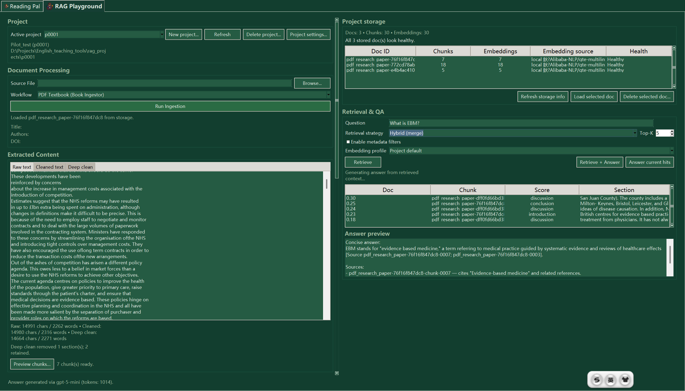

# LLM 全栈 TASK 2 学习笔记

## RAG 

RAG项目之前自己因为学习需要做过好几个了，最后做了个工作流比较完整的。

因为自己的需求主要看论文和教科书，所以只针对这两种pdf做了专门的处理。

### 论文

提取元数据（标题、作者、摘要等），用这些元数据做embedding索引的metadata，方便后续检索。清洗部分针对title，作者信息和参考文献做了专门处理。参考文献考虑后续可以用就单独提取出来放着，但是embedding的时候不放进去。

Chunking部分采用简单粗暴的fixed size chunking，论文一般比较短，没必要复杂化。

embedding用的OpenAI的text-embedding-ada-002，以及一个本地模型Alibaba-NLP/ate-multilingual-base. 

Filters部分主要是针对检索结果做的简单过滤，去掉一些不相关的内容。几个维度：首先是按照论文的结构作为不同tag，例如“Introduction”、“Methodology”、“Experiments”等等，然后根据用户的query意图，优先返回相关的section。另外用了个小的本地LLM解析摘要，针对医学论文的常见领域，例如“疾病”、“症状”、“治疗方法”“人群”等等，给chunk打tag，方便后续过滤。

Query 有简单的关键词匹配，语义，BM25和混合排序。够用了。检索优化和 rerank部分设计了但是没实装。

最后的生成部分用GPT-5-mini，便宜好用。

Prompt设计上主要是让模型基于检索到的内容回答问题，如果不相关就说不知道。还有一个要求是回答要简洁明了，避免冗长。最后就是强制引用所使用的chunk id，方便我追溯。

### 教科书

说实话教科书的“噪音”不算多，但是大量图片和表格还不知道怎么处理。教科书的pipeline先鸽了。

----

## 对比效果

### RAG QA

Q： What is EBM？
Concise answer:
EBM stands for "evidence based medicine," a term referring to medical practice guided by systematic evidence and reviews of healthcare effects [Source pdf_research_paper-76f16f847dc8-0007; pdf_research_paper-76f16f847dc8-0003].

Sources:
- pdf_research_paper-76f16f847dc8-chunk-0007 — cites "Evidence-based medicine" and related references.  
- pdf_research_paper-76f16f847dc8-chunk-0003 — discusses centres for evidence based practice, systematic reviews, and the Cochrane Collaboration.\n\n_Tokens used: 1014_

### 直接问GPT-5-mini
Question: What is EBM?

EBM most commonly means Evidence‑Based Medicine. Briefly:

- Evidence‑Based Medicine (EBM) is the practice of making clinical decisions by integrating three things: the best available research evidence, the clinician’s clinical expertise, and the patient’s values and preferences.  
- Typical steps: formulate a focused clinical question, search for relevant evidence, critically appraise that evidence for validity and applicability, apply the evidence together with clinical judgment and patient preferences, and evaluate outcomes.  
- Benefits: improves patient outcomes, reduces ineffective or harmful practices, and helps standardize care.  
- Limitations: imperfect or absent evidence for many questions, variable quality of studies, and challenges integrating individual patient circumstances.

Other common meanings (in case you meant one of these):
- Electronic Body Music (EBM): a late‑1970s/1980s electronic/industrial dance music genre (bands like Front 242, Nitzer Ebb).  
- Energy‑Based Model (EBM): in machine learning, a class of models that assign an energy (unnormalized score) to configurations — used in generative modeling.  
- Explainable Boosting Machine (EBM): an interpretable ML model (a form of generalized additive model with pairwise interactions) often used when interpretability is required.

Which meaning did you have in mind? I can expand on any of these.
Answer gpt-5-mini

---
说实话现在的LLM都比较强，比较有针对性的问题，不是隐晦知识的情况下，幻觉还是可以忍。但是一旦要认真做事，基本上RAG是必须的。

我是做医疗健康的，幻觉在我们行业容忍度极低。哪怕一些无关紧要的错误信息都可能给人造成损失。例如之前发现LLM会编造不存在的医疗机构或者诊所，如果患者按照推荐去查，绝对是浪费时间。同理，恶意植入LLM的错误信息也很容易误导患者。

LLM的能力毋庸置疑，但是在专业领域解决敏感和实际的问题，还有很长的路要走。