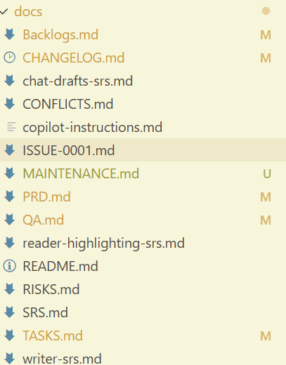

# LLM 全栈 TASK 3 学习笔记
## LLM项目分类和解析

原教程地址：https://www.datawhale.cn/activity/460/learn/242/5498

---
### 个人反思

说实话视频课程没有全部看，因为LLM领域的迭代速度注定24年的教程又会很强的滞后性。当初的真问题至少会一半变成现在的“伪需求”。并非否定教程的意义，但是LLM存在的意义之一就是我们可以通过LLM来学习LLM。按照这个思路做一个迭代式的教程比较传统教程，可能更符合当前的LLM学习需求。个人觉得LLM带来的是学习范式的改变而不是知识本身的增加，用传统的学习方式学LLM其实意义不大。

一些LLM应用在我看来是舍本逐末，或者是畸形的学习/工作场景中的“伪需求”而激发的伪需求。

例如做PPT。作为项目经理我大量需要做PPT，虽然有重复的部分，但是做PPT（或者任何其他沟通载体）本身是梳理项目，决定主次，并且提高自己说服表达力的一环。用LLM做PPT，虽然可以省去一些重复工作，但是PPT本身的价值已经从内容的组织和表达上降到了一个很低的层面。这些被AI做出来的PPT，大概率就是为了做而做的“bullshit job”。用AI做出来了又怎么样，无非是增加了一堆新的没人看的垃圾。

我用AI做，你用AI阅读并给评价，我再用AI改……用上了这样AI也只是在另外一个时空浪费人生。

对我来说非常真实需求是我输出了一堆草稿，想法，可能是语音，文字，或者纸上的鬼画符，AI能很好的帮我梳理清楚。

RAG也很有用，可以解决幻觉，并协助写作。现在大部分有意义的应有也是至少部分基于RAG的。但是RAG的难点其实不在于向量，而在于**组织策略与知识组织**。

考虑到现在是2025年12月，教程是24年8月的，所以在看视频之前，我把AI总结的课程大纲扔给了GPT5.2:

>这是一个视频的内容梗概，根据这个大纲，你认为我每个章节会讲什么？我现在能学到什么update-to-date的知识？考虑到这个是24年的教程，LLM/AI发展很快，当初的“问题”可能会变成伪问题。

说实话视频课程没有全部看，因为LLM领域的迭代速度注定24年的教程又会很强的滞后性。当初的真问题至少会一半变成现在的“伪需求”。并非否定教程的意义，但是LLM存在的意义之一就是我们可以通过LLM来学习LLM。按照这个思路做一个迭代式的教程比较传统教程，可能更符合当前的LLM学习需求。个人觉得LLM带来的是学习范式的改变而不是知识本身的增加，用传统的学习方式学LLM其实意义不大。

### GPT5.2的预测和总结：

---

#### 2. 零基础新人如何通过修改 prompt 参与大模型项目

**可能在讲什么**

* prompt 的基本结构：角色、任务、约束、输出格式
* 通过 prompt 调参替代“不会写代码”的参与方式
* demo 级项目里用 prompt 驱动模型完成摘要、问答、分类

**你现在还能学到什么**

* prompt 作为“接口契约”的思想仍然有效
* prompt 明确化、结构化的训练方式依然重要

**已经弱化或伪问题的点**

* 把“会改 prompt”当成长期壁垒已经不成立
* 现在模型对模糊 prompt 的容错率大幅提高
* 真正的价值已从 prompt 本身转向 **系统提示 + 工具调用 +数据结构**

**更新视角**
prompt 不再是技能本体，而是**系统设计中的一层配置**。

---

#### 3. 大模型辅助论文摘要与翻译项目：Chat Pick 的实现与挑战

**可能在讲什么**

* 用 LLM 做论文摘要、翻译
* 长文本切分、拼接
* 学术语气、术语一致性问题

**你现在还能学到什么**

* 文献处理 pipeline 的基本形态
* 分段处理 + 汇总的工程思路

**已经过时的点**

* “长文本是问题”已经明显缓解
* 翻译质量作为核心痛点已经不成立

**仍然真实的问题**

* 引用溯源
* 摘要是否忠于原文
* hallucination 的责任归属

**更新视角**
重点已从“能不能翻译/摘要”转向**可审计、可回溯、可验证**。

---

#### 4. 大模型驱动的 Chat BI 与表格操控技术解析

**可能在讲什么**

* 自然语言转 SQL
* Chat 控制 Excel / 表格
* BI 问答 demo

**你现在还能学到什么**

* NL → 结构化查询的设计范式
* Chat + 数据系统的交互模式

**已经变化的地方**

* 现在模型直接做 SQL、Pandas 的成功率大幅提高
* 简单 BI 问答已经商品化

**仍然是硬问题**

* 数据语义建模
* 指标口径一致性
* 权限与安全

**更新视角**
Chat BI 的难点不在 LLM，而在**数据治理和语义层**。

---

#### 5. ChatPPT 项目解析：代码操控 PPT 生成的实践与技巧

**可能在讲什么**

* 用代码或 prompt 生成 PPT
* 模板填充
* 内容结构自动化

**你现在还能学到什么**

* 结构先行的内容生成方法
* 模板驱动生成

**明显退化的点**

* PPT 生成作为“能力展示”已不稀奇
* 市面工具已经碾压 demo

**仍然有价值的地方**

* **结构抽象能力**
* 内容到表现层的映射逻辑

**更新视角**
PPT 生成不再是产品，而是**内容系统的一个输出端**。

---

#### 6. 大模型 API 调用限制下的文本处理与向量检索技术应用

**可能在讲什么**

* token 限制
* embedding
* 向量检索基础

**你现在还能学到什么**

* RAG 的雏形逻辑
* chunking、embedding、top-k

**已经变化的地方**

* API 限制放宽
* embedding 模型质量和成本大幅优化

**仍然是核心问题**

* chunk 粒度
* 元数据设计
* 检索失败的可解释性

**更新视角**
RAG 的问题不在“有没有向量”，而在**检索策略与知识组织**。

---

#### 7. 专业领域大模型应用：自定义 Embedding 与 Prompt 优化策略

**可能在讲什么**

* 领域词向量
* prompt 注入专业知识

**你现在还能学到什么**

* 领域知识结构化的重要性
* embedding 并不是“即插即用”

**已经弱化的点**

* “自己训练 embedding”的必要性下降
* 通用模型覆盖面显著扩大

**仍然成立的点**

* 领域语料清洗
* 标签与 schema 设计

**更新视角**
专业领域优势来自**数据组织方式**，不是模型本身。

---

#### 9. QA 环节：COT、SVD、BM25 及 SCI GPT 项目训练策略

**可能在讲什么**

* Chain of Thought
* 传统 IR 与 LLM 结合
* SCI GPT 训练思路

**你现在还能学到什么**

* 混合检索的思想
* 工程上如何折中效果与成本

**已经变化的地方**

* COT 显式暴露已不再推荐
* SVD 等传统方法被弱化

**仍然重要的点**

* 推理路径管理
* 评估与对齐

**更新视角**
推理从“显式链条”转向**隐式推理 + 工具验证**。

---

#### 10. 大模型训练与垂直领域应用：中医数据合成与 RAG 向量库

**可能在讲什么**

* 合成数据
* 垂直领域 RAG

**你现在还能学到什么**

* 数据稀缺领域的补救策略

**风险点**

* 合成数据的偏差放大
* 权威性问题

**更新视角**
合成数据是**临时手段**，不是长期解法。

---

#### 11. 大数据库下的 IG 项目优化与金融评估模型探讨

**可能在讲什么**

* 大规模数据
* 金融风控或评估

**你现在还能学到什么**

* LLM 与传统模型协作方式

**仍然是硬约束**

* 合规
* 可解释性

**更新视角**
LLM 在金融中更多是**辅助决策层**。

---

#### 12. 创业公司技术栈与算法工程师项目管理探讨

**可能在讲什么**

* 小团队如何落地
* 技术选型

**你现在还能学到什么**

* MVP 思维
* 资源约束下的工程判断

**仍然完全成立**

* 项目管理的重要性

---

#### 13. 大模型创业团队构建：技能需求与技术趋势分析

**可能在讲什么**

* 团队角色
* 招聘画像

**更新后的结论**

* prompt 工程师重要性下降
* 系统工程师、数据工程师更重要

---

#### 14. 大模型应用与智慧城市发展探讨

**可能在讲什么**

* 宏观应用
* 政策想象

**现实情况**

* 落地慢
* 更多停留在治理与平台层

---

#### 总体判断

**这套视频的真实价值在于**

* 工程视角
* 从 0 到 1 的项目拆解方式

**你现在要警惕的误区**

* 不要把“当年的技术难点”当成今天的学习重点
* 不要高估 prompt 技术
* 不要低估数据与系统设计

### ------GPT 引用结束------

---

个人学习LLM也一年多了，现在用的最多的是copilot+ chatgpt codex编程。

这个过程里面，我发现最重要的能力从一开始设计prompt或者用LLM做一些小任务，变成了项目管理和产品设计的能力。从一开始的担心我自己不会写代码，到现在的“不会写就不会写但是我的AI小助理会啊”的心态，其实是很大的一个心理飞跃。

绕了一圈回到了我的舒适区是真没想到。

现在用copilot编程，首先是写用户故事，产品需求，SPEC，验证计划-W-，完全做回了一个PM。唯一不同的是，LLM作为我的项目成员，虽然有时候会蠢得令人发指，但是不会告诉我，这个我不会，那个不在我的scoope。

跟LLM合作的一年是我多年来作为项目经理最有尊严的一年……

### 我自己项目docs：
没想到最后也逃不过写文档-w-

